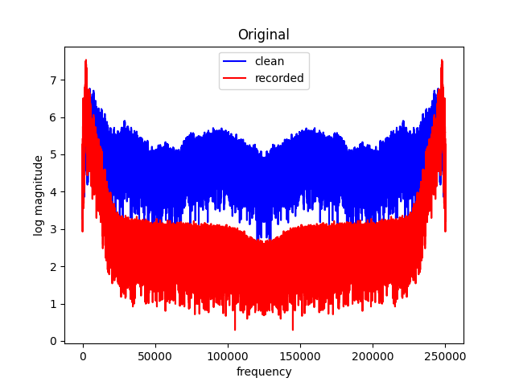

> [!NOTE] 
> For proper equation rendering, please view this documentation in day mode instead of night mode. 

# Author

An-Hsien KAO  , National Chengchi University, 116 Taipei, Taiwan. 

# Advisors 

[Pu-Zhao KOW](https://puzhaokow1993.github.io/homepage/index.html), National Chengchi University, 116 Taipei, Taiwan. 

[Yueh-Cheng KUO](https://sites.google.com/view/yckuo/home), National Chengchi University, 116 Taipei, Taiwan. 

# Introduction 

This is an audio deconvolution program, which is an alternative solution to the [Helsinki Speech Challenge 2024](https://blogs.helsinki.fi/helsinki-speech-challenge/), without involving any machine learning algorithm. 
This solution improves the solution [arXiv:2501.01650](https://arxiv.org/abs/2501.01650), which proposed by [Pu-Yun KOW](https://puyun321.github.io/) and [Pu-Zhao KOW](https://puzhaokow1993.github.io/homepage/index.html), who won the [second place](https://blogs.helsinki.fi/helsinki-speech-challenge/results/) in the challenge. 

## Task 1 (filter experiments) 

We first compute the log-FFT transform of both clean and polluted data. 
More precisely, we transform both clean and polluted data using [fast fourier transformc (FFT)](https://numpy.org/doc/stable/reference/routines.fft.html) in `numpy`, and then taking the logarithm of the magnitude of the transformed data. 
We compute the average difference  over all training samples. 
For each test sample, we estimate the clean spectrum by adding the average difference to the log-FFT of the recorded signal. 
The corrected spectrum is then transformed back to the time domain using the inverse FFT. 
This approach restores high-frequency content and improves clarity in muffled recordings. 

 

## Task 2 (reverberation experiments) 

As mentioned in [arXiv:2501.01650](https://arxiv.org/abs/2501.01650), it is difficult to train the phase. We assume that the reverberation can be modeled as the convolution of a clean signal with a decaying impulse response:

  
![y[n]=x[n]*h[n]](https://latex.codecogs.com/png.image?\dpi{110}y[n]=x[n]*h[n]) 

where  =e^{-\lambda%20t}). We estimate the decay factor  using the following relation: 

  

where  is the reverberation time we sampled from training data.
Then, we perform deconvolution by simple division:

  
![\mathcal{F}(x[n])\approx\frac{\mathcal{F}(y[n])}{\mathcal{F}(h[n])}](https://latex.codecogs.com/png.image?\dpi{110}\mathcal{F}(x[n])\approx\frac{\mathcal{F}(y[n])}{\mathcal{F}(h[n])})

where  is the [fast fourier transformc (FFT)](https://numpy.org/doc/stable/reference/routines.fft.html) in `numpy` mentioned above. 
Finally, we apply the same high-frequency correction technique used in [Task 1 (filter experiments)](#task-1-filter-experiments) above. 

## Task 3 (hybrid experiments) 

We use the same methods as in [Task 2 (reverberation experiments)](#task-2-reverberation-experiments) above. 

# Requirements 

As no neural network algorithms are involved, our program has no stringent requirements. A `requirements.txt` file is still provided, just in case. 

> [!IMPORTANT] 
> The programs only handle 16-bit 16kHz audio files, in `.wav` format.

# Results 

We compare our results to the top entries in the [Helsinki Speech Challenge 2024](https://blogs.helsinki.fi/helsinki-speech-challenge/). 
To evaluate the quality of speech restoration, we use a metric in speech regognition called the Character Error Rate (CER). 
A lower CER indicates better intelligibility and restoration quality. 
We use a pretrained [DeepSpeech](https://github.com/mozilla/DeepSpeech) model to transcribe both the original and restored audio signals. 
The transcriptions are then compared to the ground truth text to compute the CER. 
The top-performing teams primarily used deep learning models for speech enhancement. 
ur method is based entirely on mathematical modeling and signal processing, using the Fourier domain and a simple statistical estimation from training data. Thus, the method itself is lightweight with extremely low real-time factors (RTF).
In some cases, [DeepSpeech](https://github.com/mozilla/DeepSpeech) fails to capture the actual improvement, but human listeners report a clear increase in intelligibility after processing.

 

Here are some demos: 

[comment]: <> (https://docs.github.com/en/get-started/writing-on-github/getting-started-with-writing-and-formatting-on-github/basic-writing-and-formatting-syntax)
